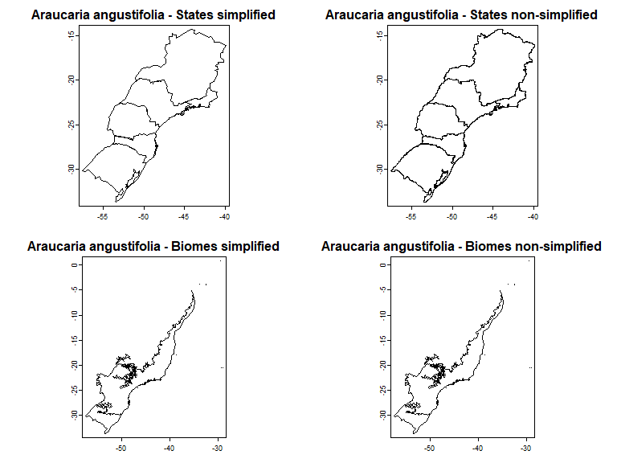
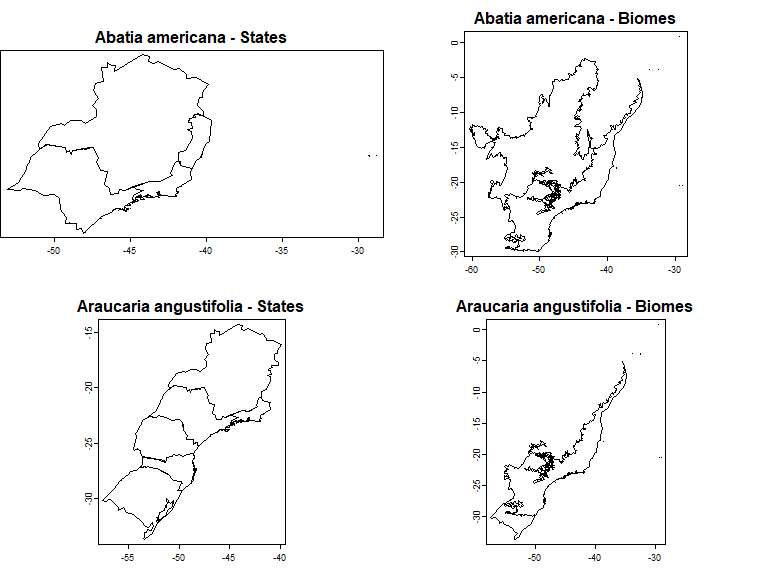
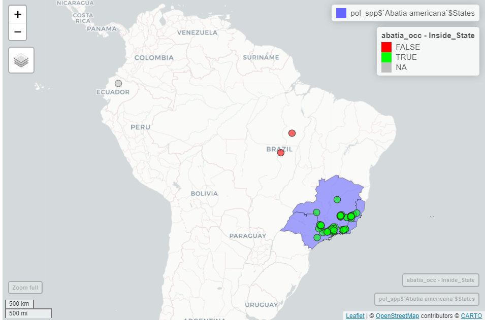
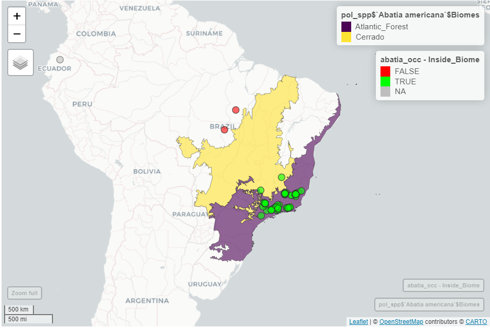
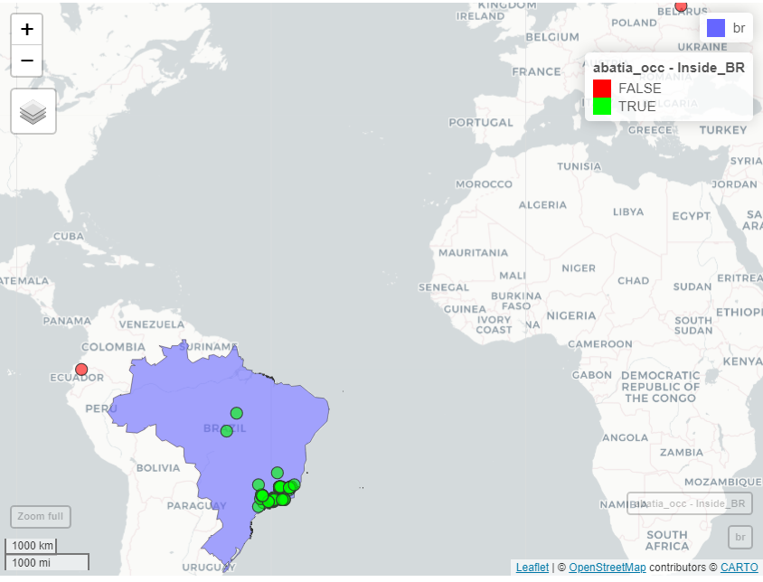

```{r, include = FALSE}
knitr::opts_chunk$set(
  collapse = TRUE,
  comment = "#>",
  warning = FALSE,
  message  = FALSE,
  eval = FALSE,
  fig.width = 8,
  fig.height = 6
)
```

## Loading data
Before you begin, use the `load_florabr` function to load the data. For more detailed information on obtaining and loading the data, please refer to [1. Getting started with florabr](getting_started.html)

```{r Get data, results='hide', message=FALSE, warning=FALSE, echo=FALSE}
my_dir <- file.path(file.path(tempdir(), "florabr"))
dir.create(my_dir)
get_florabr(output_dir = my_dir, #directory to save the data
            data_version = "latest", #get the most recent version available
            overwrite = T) #Overwrite data, if it exists
```

```{r, message=FALSE, warning=F}
library(florabr)
library(terra)
#Folder where you stored the data with the function get_florabr()
#Load data
bf <- load_florabr(data_dir = my_dir,
                   data_version = "Latest_available",
                   type = "short") #short version
#> Loading version 393.401
```


## Get spatial polygons of species distribution
Flora e Funga do Brasil provides information on the federal states and biomes with confirmed occurrences of the species in Brazil. The `get_spat_occ` function extracts these information and return Spatial polygons (SpatVectors) representing the distribution of the specie. We can choose getting the Spatialvector of the federal states, biomes and the intersection between states and biomes.

```{r}
#Example species
spp <- c("Araucaria angustifolia", "Adesmia paranensis")
#Get spatial polygons
spp_spt <- get_spat_occ(data = bf, species = spp,
                       state = TRUE, biome = TRUE, intersection = TRUE,
                       verbose = TRUE)
#> Getting states of Araucaria angustifolia 
#> Getting biomes of Araucaria angustifolia 
#> Getting biomes of Araucaria angustifolia 
#> Getting states of Adesmia paranensis 
#> Getting biomes of Adesmia paranensis 
#> Getting biomes of Adesmia paranensis
```

The SpatVectors are stored in a nested list by species:

```{r}
par(mfrow = c(3, 2), mar = c(2, 0, 2, 0)) 
plot(spp_spt$`Araucaria angustifolia`$states,
     main = paste0(names(spp_spt)[[1]], " - States"), mar = NA)
plot(spp_spt$`Araucaria angustifolia`$biomes,
     main = paste0(names(spp_spt)[[1]], " - Biomes"), mar = NA)
plot(spp_spt$`Araucaria angustifolia`$states_biomes,
     main = paste0(names(spp_spt)[[1]], " - Intersection"), mar = NA)
plot(spp_spt$`Adesmia paranensis`$states,
     main = paste0(names(spp_spt)[[2]], " - States"), mar = NA)
plot(spp_spt$`Adesmia paranensis`$biomes,
     main = paste0(names(spp_spt)[[2]], " - Biomes"), mar = NA)
plot(spp_spt$`Adesmia paranensis`$states_biomes,
     main = paste0(names(spp_spt)[[2]], " - Intersection"), mar = NA)
```

```{r IMG01, eval=TRUE, echo=FALSE}
knitr::include_graphics("vignettes_img/IMG01.png")
```

### Including a more complex polygon of states and biomes
As default, `florabr` uses a simplified polygon of federal States and biomes, with a reduced number of nodes representing the boundaries of states and biomes (check `?terra::simplifyGeom`):

```{r}
data("states")
states <- terra::unwrap(states)
data("biomes")
biomes <- terra::unwrap(biomes)
par(mfrow = c(2, 1), mar = c(0, 0, 0, 0)) 
plot(states, main = "Brazilian states with simplified geometries")
plot(biomes, main = "Brazilian biomes with simplified geometries")
```

```{r IMG02, eval=TRUE, echo=FALSE}
knitr::include_graphics("vignettes_img/IMG02.png")
```

We can work with the original spatial polygons, which represents better the real shapes and boundaries of states and biomes. To do that, let's get the original data from `geobr`package:

```{r, warning=FALSE, results='hide', message=FALSE}
#Install geobr if necessary and load package
if(!require(geobr)){
    install.packages("geobr")
}
#Load geobr
library(geobr)
```

Let`s start with the polygon of federal states of Brazil:

```{r, warning=FALSE, results='hide', message=FALSE}
br_states <- geobr::read_state(simplified = FALSE)
#Convert br_states from sf to SpatVect
br_states <- vect(br_states)
```

Note that now, the geometries of *br_states* (not simplified) are more complex than the simplified *states*:

```{r}
#Plot only State of Parana as example
par(mfrow = c(1, 2), mar = c(2, 2, 2, 2)) 
plot(br_states[br_states$abbrev_state == "PR"],
     main = "Not simplified geometries", mar = NA)
plot(states[states$abbrev_state == "PR"],
     main = "Simplified geometries",
     mar = NA)
```
```{r IMG03, eval=TRUE, echo = FALSE}
knitr::include_graphics("vignettes_img/IMG03.png")
```
Now, let's get the original polygons of biomes:

```{r, warning=FALSE, results='hide'}
br_biomes <- geobr::read_biomes()
#Convert br_biomes from sf to SpatVect
br_biomes<- terra::vect(br_biomes)
#Drop off coastal system:
br_biomes <- terra::subset(br_biomes, 
                           br_biomes$name_biome != "Sistema Costeiro")
```

The names of the biomes are in Portuguese. We need to translate Amazonia and Mata Atlantica to English to match with the names in Flora e Funga do Brasil:

```{r, results='hide'}
#See names of biomes
br_biomes$name_biome
#Names that must be in the Spatvector to match with Flora e Funga do Brasil:
biomes$name_biome
#> [1] "Amazônia"       "Caatinga"       "Cerrado"        "Mata Atlântica"
#> [5] "Pampa"          "Pantanal"
#Translate
br_biomes$name_biome[which(br_biomes$name_biome == "Amazônia")] <- "Amazon"
br_biomes$name_biome[which(
  br_biomes$name_biome == "Mata Atlântica")] <- "Atlantic_Forest"
```

Now, the SpatVector of biomes is also ready to use. Let's see the difference when we use this non-simplified Spatvectors in the `get_spat_occ`:

```{r}
spp_spt_2 <- get_spat_occ(data = bf, species = spp,
                state = TRUE, biome = TRUE, intersection = TRUE,
                state_vect = br_states, #The non-simplified Spatvector
                state_column = "abbrev_state", #Column name with states acronyms
                biome_vect = br_biomes, #The non-simplified Spatvector
                biome_column = "name_biome", #Column name with names of biomes
                verbose = TRUE)
```

See the difference: now, the polygons representing the distribution of species in states and biomes are more complex:

```{r}
par(mfrow = c(2, 2), mar = c(2, 2, 2, 2)) 
plot(spp_spt$`Araucaria angustifolia`$states,
     main = paste0(names(spp_spt)[[1]], " - States simplified"), mar = NA)
plot(spp_spt_2$`Araucaria angustifolia`$states,
     main = paste0(names(spp_spt)[[1]], " - States non-simplified"), mar = NA)
plot(spp_spt$`Araucaria angustifolia`$biomes,
     main = paste0(names(spp_spt)[[1]], " - Biomes simplified"), mar = NA)
plot(spp_spt$`Araucaria angustifolia`$biomes,
     main = paste0(names(spp_spt)[[1]], " - Biomes non-simplified"), mar = NA)
```
```{r IMG04, eval=TRUE, echo = FALSE}

```

The choose between using the simplified version (default) or using a personal e more complex polygons depends on the objectives and resolution of your work. For a objective that depends on more fine resolution, we suggest to use more complex polygons that represent better the real shapes and boundaries of states and biomes.


## Filtering occurrence records using distribution information in Flora e Funga do Brasil

Georeferencing errors in online species records can introduce significant bias into ecological and biogeographical research findings. Some R packages, as `CoordinateCleaner`, help to flagging common spatial errors in biological collection data, for example, records of terrestrial organism that fall in the sea or were assigned to capital and province centroids.
Since the distributions of species in Flora e Funga do Brasil are based on the expertise of taxonomists, it represents a valuable information to add an additional step on checking the validity of occurrence records got from online databases (as GBIF or SpeciesLink). 
The `filter_florabr` function automatized this flagging. You can use the function to flag and/or remove:
* Records that fall outside the states and biomes which confirmed occurrence according to Flora e Funga do Brasil.
* For species endemic to Brazil, records that falls in other countries.

As example, let's use the occurrence records of two species. *Abatia americana* is an endemic shrub with confirmed occurrences in 4 states (ES, MG, RJ and SP) and two biomes (Atlantic Forest and Cerrado). *Araucaria angustifolia* is a non-endemic tree that in Brazil has confirmed occurrences in 6 states (MG, PR, RJ, RS, SC and SP) and two biomes (Atlantic Forest and Pampa). Let's plot these information using the function `get_spat_occ`:

```{r}
my_spp <- c("Abatia americana", "Araucaria angustifolia")
pol_spp <- get_spat_occ(data = bf, species = my_spp,
                       state = TRUE, biome = TRUE, intersection = TRUE,
                       verbose = TRUE)
par(mfrow = c(2, 2), mar = c(2, 0, 2, 0)) 
plot(pol_spp$`Abatia americana`$states,
     main = paste0(names(pol_spp)[[1]], " - States"), mar = NA)
plot(pol_spp$`Abatia americana`$biomes,
     main = paste0(names(pol_spp)[[1]], " - Biomes"), mar = NA)
plot(pol_spp$`Araucaria angustifolia`$states,
     main = paste0(names(pol_spp)[[2]], " - States"), mar = NA)
plot(pol_spp$`Araucaria angustifolia`$biomes,
     main = paste0(names(pol_spp)[[2]], " - Biomes"), mar = NA)
```
```{r IMG05, eval=TRUE, echo = FALSE}

```
We downloaded the occurrences of these two species from GBIF using the `plantR::rgbif2()` function. These occurrences are saved as data examples in the package and we can import it:

```{r}
data("occurrences")
#select Abatia americana and Araucaria angustifolia from the dataset
occ <- subset(occurrences, occurrences$species %in% my_spp)
head(occ)
#>                  species         x         y
#> 1 Araucaria angustifolia -51.15749 -29.58290
#> 2 Araucaria angustifolia -50.02454 -28.44414
#> 3 Araucaria angustifolia -46.77204 -23.45729
#> 4 Araucaria angustifolia -48.98117 -25.49632
#> 5 Araucaria angustifolia -54.50869 -25.55113
#> 6 Araucaria angustifolia -50.92680 -27.01826
```

The input data with records must be a dataframe with at least 3 columns: one informing the species name, one informing the longitude and one informing the latitude.
Let's check if there are records outside of the species' natural ranges considering states, biomes and endemism:

```{r}
occ_check <- filter_florabr(data = bf, occ = occ,
                    by_state = TRUE, buffer_state = 20,
                    by_biome = TRUE, buffer_biome = 20,
                    by_endemism = TRUE, buffer_brazil = 20,
                    state_vect = NULL,
                    biome_vect = NULL, br_vect = NULL,
                    value = "flag&clean", keep_columns = TRUE,
                    verbose = FALSE)
#> Returning list with flagged and cleaned occurrences
```

Since we set *value = "flag&clean"*, the function returned a list with two data.frames: one with all the records flagged if on each test they passed (TRUE) or not (FALSE); and another with only the records that passed in all tests.

Let's use the [mapview package](https://r-spatial.github.io/mapview/) to plot an interactive map of the flagged records:

```{r, warning=FALSE, results='hide'}
#Install mapview if necessary and load package
if(!require(mapview)){
    install.packages("geobr")
}
#Load mapview
library(mapview)
```

Let's check the records of *Abatia americana*, plotting the records and the map got previously. You can see that the green records passed on the test of States, falling in the states with confirmed occurrence of the specie. The red dots are the records that falls outside the states. And the gray dots are records that was not testes because they falls outside Brazil (Ecuador and Belarus).

```{r, fig.width= 9}
#Convert points to spatvector
abatia_occ <- subset(occ_check$flagged,
                     occ_check$flagged$species == "Abatia americana")
abatia_occ <- vect(abatia_occ, geom = c("x", "y"))

#Iteractive plot
mapview(pol_spp$`Abatia americana`$states) +
  mapview(abatia_occ, zcol = "inside_state",
          col.regions = c("red", "green"))
```
```{r IMG06, eval=TRUE, echo = FALSE, fig.pos="H", out.width="90%"}

```

We can see the same with biomes: green dots represents records that passed in the test, green dots represents records that did not passed the test, and gray dots are records not tested because they fall outside Brazil.

```{r, fig.width= 9}
#Iteractive plot
mapview(pol_spp$`Abatia americana`$biomes) +
  mapview(abatia_occ, zcol = "inside_biome",
          col.regions = c("red", "green"))

```
```{r IMG07, eval=TRUE, echo = FALSE, fig.pos="H", out.width="90%"}

```

Finally, since *Abatia americana* is a specie endemic to Brazil, we don't expect records outside the country. The records in Ecuador and Belarus were flagging in this test:
```{r, results='hide'}
#Get Brazl Polygon
br <- geobr::read_country()
```

```{r, warning=FALSE}
#Iteractive plot
mapview(br) +
  mapview(abatia_occ, zcol = "inside_br",
          col.regions = c("red", "green"))
```
```{r IMG08, eval=TRUE, echo = FALSE, fig.pos="H", out.width="90%"}

```
